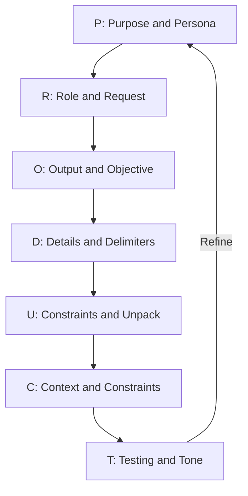
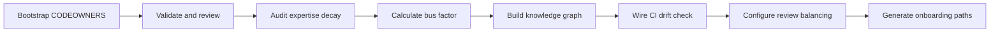

# The P.R.O.D.U.C.T. Prompting Framework for checkOwners

> "A good prompt is a lever; give it the right fulcrum and it can move an AI." (adapted from Archimedes)

This document applies the P.R.O.D.U.C.T. framework to the real operational tasks you face as a checkOwners user: bootstrapping ownership inference with confidence scoring, reviewing drift reports with confidence deltas, building knowledge graphs, detecting expertise decay, calculating bus factors, balancing review loads, generating onboarding paths, and wiring CI.

Use it as a prompting reference. Pick the task you need to accomplish, compose the prompt from the pillar values for that task, and paste it into Claude Code or any other AI assistant.

---

## The Framework Overview

**P.R.O.D.U.C.T.** transforms scattered intent into deterministic, high-quality AI outputs. Each letter is a required prompt pillar:

| Letter | Pillar | Core Question |
|--------|--------|---------------|
| **P** | **Purpose & Persona** | What is the goal and who should the AI be? |
| **R** | **Role & Request** | What authority and what core action? |
| **O** | **Output & Objective** | What format and why does success matter? |
| **D** | **Details & Delimiters** | What facts and how to structure them? |
| **U** | **User Constraints & Unpack** | What rules and how to reason? |
| **C** | **Context & Constraints** | What background and what limits? |
| **T** | **Testing & Tone** | How to validate and how to sound? |

---

## Framework Flow



---

## checkOwners User Workflow

```mermaid
flowchart LR
    Install[pip install checkowners] --> Analyze[checkowners analyze]
    Analyze --> Expertise[checkowners expertise]
    Expertise --> Decay[checkowners decay]
    Decay --> BusFactor[checkowners bus-factor]
    BusFactor --> Graph[checkowners graph]
    Graph --> Generate[checkowners generate]
    Generate --> Validate[checkowners validate]
    Validate --> Drift[checkowners drift]
    Drift --> Balance[checkowners balance]
    Balance --> Onboard[checkowners onboard]
    Onboard --> CI[GitHub Actions CI]
    CI -->|on push| Drift
```



---

## Prompt Anatomy

```
P: <Purpose> | <Persona>
R: <Role> | <Request>
O: <Output spec> | <Objective>
D: <Details and data> | <Delimiters>
U: <User constraints> | <Unpack directive>
C: <Context and continuity> | <Constraints>
T: <Testing hook> | <Tone>
```

---

## P: Purpose & Persona

**Purpose** declares your operational goal in one declarative line.
**Persona** assigns the AI a specific identity grounded in your domain so it makes the right trade-offs.

### Example 1: Bootstrap with Confidence Scoring (repo with no CODEOWNERS)

```
P: Infer de-facto ownership with confidence scores for a monorepo that has
   never had a CODEOWNERS file, identify paths with bus_factor=1, and
   generate an accurate first draft with confidence-weighted owner ordering.
   You are a senior platform engineer at a 200-person engineering org who owns
   the GitHub review routing policy for a 500k-LOC monorepo and has successfully
   reduced review bottlenecks by 40% through data-driven ownership assignment.
```

### Example 2: Expertise Decay Audit

```
P: Run an expertise decay audit across the entire repository to identify
   owners whose knowledge is stale and recommend ownership transfers.
   You are a staff engineer who manages code review SLAs across 15 teams
   and has handled 3 major ownership transitions after team reorganizations.
```

### Example 3: Bus Factor Risk Assessment

```
P: Calculate the bus factor for every path in the repository and produce
   a risk report identifying single-point-of-knowledge failures before
   they become incidents.
   You are an engineering manager who has experienced knowledge loss when
   a critical engineer left and is building organizational resilience.
```

### Example 4: Onboarding Path Generation

```
P: Generate a structured onboarding path for a new engineer joining the
   payments team, based on the ownership graph from broad-knowledge files
   to deep-expertise files.
   You are a tech lead who has onboarded 20+ engineers to large codebases
   and knows that effective onboarding follows the knowledge topology.
```

### Example 5: CI Integration

```
P: Wire checkowners drift into our GitHub Actions CI pipeline so every PR
   that touches CODEOWNERS-governed paths triggers a drift check with
   confidence delta reporting and bus factor alerts.
   You are a DevOps engineer who owns the CI/CD platform for a 50-engineer org
   and has experience publishing and consuming GitHub Actions.
```

---

## R: Role & Request

**Role** establishes the AI's authority.
**Request** is the single, unambiguous action verb.

### Example 1: Generate CODEOWNERS with Confidence

```
R: CODEOWNERS maintainer | Run checkowners analyze, review the confidence-scored
   ownership map, generate a .github/CODEOWNERS file with confidence-weighted
   ordering, and flag all paths with bus_factor=1 for immediate attention.
```

### Example 2: Interpret Drift with Confidence Delta

```
R: Ownership auditor | Parse the JSON output of checkowners drift, rank
   findings by confidence delta (highest change first), and produce a
   prioritized remediation list distinguishing decay-driven drift from
   structural drift.
```

### Example 3: Build Knowledge Graph

```
R: Knowledge architect | Run checkowners graph and checkowners topology to
   produce a contributor-file relationship graph, export it as DOT format,
   and annotate it with team topology clusters.
```

### Example 4: Balance Review Load

```
R: Review process optimizer | Analyze PR review distribution using checkowners
   balance, identify overloaded reviewers, and produce rebalancing recommendations
   that route reviews to qualified but underutilized contributors.
```

---

## O: Output & Objective

### Example 1: Initial CODEOWNERS with Bus Factor Report

```
O: Two deliverables: (1) a .github/CODEOWNERS file that passes checkowners validate
   with zero errors, with confidence scores as inline comments, and (2) a Markdown
   table listing every path with bus_factor <= 2, its current owners, confidence
   scores, and recommended backup reviewers.
   Objective: replace the 14-month-old manually maintained CODEOWNERS with an
   inference-backed file AND reduce bus factor risk across the repository.
```

### Example 2: Expertise Decay Report

```
O: A Rich-formatted table showing all decaying expertise entries: contributor,
   path, last commit date, days since last commit, historical confidence score,
   current confidence score, and recommended transfer target.
   Objective: identify all ownership entries that are effectively stale and
   produce actionable transfer recommendations before the next team reorg.
```

### Example 3: Onboarding Path

```
O: A Markdown checklist suitable for inclusion in an onboarding document,
   with 10-15 steps going from broadly-owned files to deep-expertise files,
   each step listing: the path, recommended reviewer, estimated complexity
   (easy/medium/hard), and a one-line description of what the newcomer will learn.
   Objective: reduce new-engineer onboarding time from 3 weeks to 1 week by
   providing a structured learning path based on actual ownership data.
```

---

## D: Details & Delimiters

### Example 1: Bootstrap Config with Confidence Scoring

```
D: Config file (.github/checkowners.yml):
   analysis:
     lookback_days: 365
     min_commits: 3
     top_n_owners: 3
     confidence_threshold: 0.3
   scoring:
     recency_half_life_days: 90
     recency_weight: 0.35
     frequency_weight: 0.25
     blame_weight: 0.25
     review_weight: 0.15
   decay:
     threshold_days: 180
   bus_factor:
     critical_threshold: 1
     warn_threshold: 2
   paths:
     exclude:
       - "*.lock"
       - "dist/**"
       - "vendor/**"
       - "node_modules/**"

   Repo facts: 15 active contributors, 500k LOC, no existing CODEOWNERS.
   3 contributors left the company in the last 6 months.

### ANALYZE OUTPUT ###
{
  "inferred": {
    "src/api/": {
      "owners": [
        {"handle": "@alice", "confidence": 0.92, "last_commit": "2026-03-25", "commits": 145},
        {"handle": "@bob", "confidence": 0.71, "last_commit": "2026-03-20", "commits": 67}
      ],
      "bus_factor": 2
    },
    "src/payments/": {
      "owners": [
        {"handle": "@carol", "confidence": 0.85, "last_commit": "2026-03-15", "commits": 98}
      ],
      "bus_factor": 1
    },
    "src/auth/": {
      "owners": [
        {"handle": "@dave", "confidence": 0.34, "last_commit": "2025-06-12", "commits": 42}
      ],
      "bus_factor": 1,
      "decay_warnings": ["@dave: 289 days since last commit"]
    }
  }
}
### END ###
```

### Example 2: Drift Report with Confidence Delta

```
D: Drift report from checkowners drift --json:
   {
     "stale": [
       {"path": "src/infra/", "confidence_delta": 0.85, "reason": "team dissolved"},
       {"path": ".github/", "confidence_delta": 0.42, "reason": "contributor left"}
     ],
     "missing": [
       {"path": "src/payments/", "bus_factor": 1, "reason": "new path, no CODEOWNERS entry"},
       {"path": "src/auth/", "bus_factor": 1, "decay": true}
     ],
     "changed": [
       {"path": "src/api/", "confidence_delta": 0.15, "reason": "new primary contributor"}
     ],
     "drift_detected": true
   }
   Context: @org/infra team was dissolved 6 months ago.
   @carol left the company last month.
   @eve was recently hired and has been committing to src/payments/.

### DESIRED OUTPUT ###
Section 1: Critical (bus_factor=1 + decay)
Section 2: Remove (safe to delete)
Section 3: Reassign (suggest replacement owner with confidence score)
Section 4: Monitor (minor drift, low confidence delta)
### END ###
```

---

## U: User Constraints & Unpack

### Example 1: CODEOWNERS Generation with Confidence

```
U: Constraints:
   - Do not add any owner with confidence score below 0.3.
   - Flag paths with bus_factor=1 as CRITICAL; require immediate backup reviewer assignment.
   - Owners must be ordered by confidence score (highest first) in the generated CODEOWNERS.
   - Include confidence comments: "# @alice (0.92) @bob (0.71)".
   - Paths with decay warnings must include a comment noting the decay.
   - The file must not exceed 150 lines.
   Unpack: Before generating the file, list each path group with confidence scores
   and bus factor, flag critical risks, then propose backup reviewers for bus_factor=1
   paths, then write the CODEOWNERS file.
```

### Example 2: Expertise Decay Remediation

```
U: Constraints:
   - Do not suggest removing a decaying owner without proposing a replacement with
     confidence >= 0.5.
   - Transfer recommendations must target active contributors who have touched
     adjacent paths (related expertise).
   - For paths with no viable replacement, flag for team lead triage.
   Unpack: Walk through each decaying entry, assess replacement candidates from
   the knowledge graph, score their fitness, then produce the transfer plan.
```

### Example 3: Review Load Balancing

```
U: Constraints:
   - Do not suggest routing reviews to contributors with confidence < 0.5.
   - Maximum review load increase for any contributor: 30%.
   - Do not reduce the primary reviewer's load below 40% of their current reviews.
   Unpack: First calculate current review load per contributor, then identify
   overloaded reviewers (>2x average), then find qualified alternatives from
   the knowledge graph, then produce rebalancing recommendations.
```

---

## C: Context & Constraints

### Example 1: Bootstrap (stale team problem with confidence data)

```
C: The repo previously used a manually maintained CODEOWNERS that referenced
   @org/infra (dissolved 6 months ago, confidence decayed to 0.0) and @alice
   (left the company, confidence decayed from 0.88 to 0.0).
   checkowners analyze has identified these as stale entries with confidence 0.0.
   The eng-platform team (@org/eng-platform) has been committing to infra paths
   with an emerging confidence of 0.65.
   Constraint: the generated CODEOWNERS must pass checkowners validate with
   zero errors AND have bus_factor >= 2 for all critical paths.
```

### Example 2: Onboarding Context

```
C: A new engineer (@newdev) is joining the payments team next week.
   The payments codebase has bus_factor=1 (only @carol has confidence > 0.5).
   @carol is going on parental leave in 2 months.
   The onboarding path must prioritize building @newdev's expertise in payments
   so bus_factor reaches 2 before @carol's leave.
   Constraint: the onboarding path must be completable in 4 weeks with
   2-3 hours of code review per day.
```

### Example 3: Team Topology Context

```
C: The organization has 4 declared GitHub teams: api-team, data-team,
   infra-team (dissolved), and mobile-team.
   checkowners topology has inferred 5 clusters, including an undeclared
   "devops-team" that spans infra and CI paths.
   The inferred topology does not match the declared teams for 3 paths.
   Constraint: the topology report must highlight mismatches between
   declared and inferred teams and recommend org chart updates.
```

---

## T: Testing & Tone

### Example 1: CODEOWNERS Output

```
T: Validate: run checkowners validate on the generated file and confirm zero errors;
   run checkowners drift and confirm drift_detected=false; verify bus_factor >= 2
   for all paths marked as critical; verify no owner has confidence < 0.3.
   Tone: concise and direct; flag bus_factor=1 as CRITICAL with explicit urgency;
   include confidence scores in every finding; no hedging language.
```

### Example 2: Bus Factor Report

```
T: Validate: every bus_factor=1 path must include a recommended backup reviewer
   with confidence >= 0.3. The report must cover all paths in the repository.
   Tone: risk-oriented; use severity levels (CRITICAL, WARNING, OK); one-line
   per path; include confidence scores for current and recommended owners.
```

### Example 3: Onboarding Path

```
T: Validate: the onboarding path must contain 10-15 steps; each step must have
   a different recommended reviewer; complexity must increase progressively
   (no hard steps before medium steps). The path must be completable in 4 weeks.
   Tone: welcoming but structured; each step is actionable; include estimated
   time commitment per step.
```

---

## Complete Example: Wiring checkOwners with Confidence + Bus Factor into GitHub Actions CI

### Prompt

```
P: Add checkowners drift detection with confidence delta reporting and bus factor
   alerts to our GitHub Actions CI pipeline so every pull request that modifies
   code in CODEOWNERS-governed paths triggers a check and posts a summary
   comment with risk severity.
   You are a DevOps engineer who owns the CI/CD platform for a 50-engineer
   GitHub org and has experience with data-driven code review optimization.

R: CI platform engineer | Write a new GitHub Actions workflow file
   (.github/workflows/checkowners.yml) that uses checkowners-action,
   runs drift detection with confidence delta, calculates bus factor for
   modified paths, fails the check when drift_detected=true, and posts
   a formatted PR comment with drift summary and bus factor risk level.

O: A complete, valid .github/workflows/checkowners.yml with annotated
   non-obvious choices, plus a one-paragraph explanation of how to
   enable it as a required status check.
   Objective: make CODEOWNERS drift AND bus factor risk visible during
   code review before changes reach main.

D: Existing setup:
   - Runner: ubuntu-latest, Python 3.11 available
   - checkowners-action published at checkowners/checkowners-action@v1
   - checkowners.yml config committed at .github/checkowners.yml
   - Confidence threshold: 0.3; bus factor critical: 1; decay threshold: 180 days
   - Required behavior: fail on pull_request if drift_detected=true;
     add CRITICAL label if any modified path has bus_factor=1;
     do NOT fail on push to main

### DESIRED WORKFLOW STRUCTURE ###
name: checkowners
on: [pull_request]
jobs:
  drift:
    steps:
      - checkout
      - run checkowners-action (drift + bus-factor)
      - post PR comment with drift + risk summary
      - add CRITICAL label if bus_factor=1
      - fail step if drift_detected=true
### END ###

U: Constraints:
   - Pin the action to a version tag (v1).
   - The PR comment must include: drift categories (stale, missing, changed) with
     confidence deltas, bus factor summary, and expertise decay warnings.
   - Bus factor=1 paths must be highlighted with a CRITICAL severity marker.
   - Use a collapsible Markdown details block for the full drift report.
   - Do not block push events; only gate pull_request.
   Unpack: First describe the workflow structure, then the drift check logic,
   then the bus factor check, then the comment format, then the failure condition.

C: The org requires all required status checks to pass before merge.
   A false-positive drift alert would block all PRs, so the check must only fail
   when drift_detected=true in the action output.
   The team recently lost a critical contributor, making bus factor alerts
   a high priority for the engineering manager.
   Constraint: the workflow must not require any secrets beyond GITHUB_TOKEN.

T: Validate: the YAML must be parseable by actionlint with zero errors;
   the checkowners-action step must use a pinned version tag;
   the PR comment must render correctly in GitHub Markdown.
   Tone: annotate non-obvious YAML choices with a single-line comment;
   no other inline comments; keep the file under 80 lines.
```

### Generated Output

```yaml
name: checkowners

on:
  pull_request:

jobs:
  drift:
    runs-on: ubuntu-latest
    permissions:
      contents: read
      pull-requests: write
      issues: write          # required to add labels

    steps:
      - uses: actions/checkout@v4
        with:
          fetch-depth: 0     # full history required for git blame analysis

      - name: Run checkOwners drift + bus factor
        id: checkowners
        uses: checkowners/checkowners-action@v1
        with:
          mode: repo
          config: .github/checkowners.yml
          include_bus_factor: true
          include_decay: true

      - name: Post drift and risk summary comment
        if: fromJson(steps.checkowners.outputs.checkowners_drift).drift_detected
        uses: actions/github-script@v7
        with:
          script: |
            const drift = JSON.parse('${{ steps.checkowners.outputs.checkowners_drift }}');
            const busFactor = JSON.parse('${{ steps.checkowners.outputs.bus_factor_summary }}');
            const critical = busFactor.critical_paths || [];
            const severityBadge = critical.length > 0 ? '**CRITICAL**' : 'WARNING';

            const body = [
              `### checkOwners Drift Detected (${severityBadge})`,
              '',
              critical.length > 0
                ? `> **${critical.length} path(s) with bus_factor=1:** ${critical.join(', ')}`
                : '',
              '',
              '<details><summary>Drift Details</summary>',
              '',
              '| Category | Paths | Confidence Delta |',
              '|----------|-------|------------------|',
              ...(drift.stale || []).map(s => `| Stale | ${s.path} | -${s.confidence_delta.toFixed(2)} |`),
              ...(drift.missing || []).map(m => `| Missing | ${m.path} | bus_factor=${m.bus_factor} |`),
              ...(drift.changed || []).map(c => `| Changed | ${c.path} | ${c.confidence_delta.toFixed(2)} |`),
              '',
              '</details>',
              '',
              'Run `checkowners sync` locally to resolve.'
            ].filter(Boolean).join('\n');

            github.rest.issues.createComment({
              issue_number: context.issue.number,
              owner: context.repo.owner,
              repo: context.repo.repo,
              body
            });

      - name: Add CRITICAL label if bus_factor=1
        if: fromJson(steps.checkowners.outputs.bus_factor_summary).critical_paths[0]
        uses: actions/github-script@v7
        with:
          script: |
            github.rest.issues.addLabels({
              issue_number: context.issue.number,
              owner: context.repo.owner,
              repo: context.repo.repo,
              labels: ['ownership-critical']
            });

      - name: Fail if drift detected
        if: fromJson(steps.checkowners.outputs.checkowners_drift).drift_detected
        run: |
          echo "CODEOWNERS drift detected. Run checkowners sync to resolve."
          exit 1
```

**To enable as a required status check:** Go to Settings > Branches > Branch protection rules for `main`, add `drift` (the job name) under "Require status checks to pass before merging," and save.

---

## Advanced Patterns

### Chained Prompts for a Full checkOwners Adoption with Knowledge Intelligence

Break a full adoption rollout into sequential prompts, each inheriting context from the prior step.



### Conditional Logic by Repo Type

```
U (monorepo): exclude generated paths; set top_n_owners: 3; enable topology inference
U (small repo): set min_commits: 1 to catch all contributors; bus_factor less critical
U (high turnover): set decay threshold to 90 days; increase recency weight to 0.5
U (first bootstrap): set include_unowned: true; accept lower confidence threshold (0.2)
```

### Dynamic Validation Rubric

```
T: Before finishing, validate against this rubric and report results:
   - checkowners validate exits 0 on the generated CODEOWNERS file (boolean)
   - checkowners drift reports drift_detected=false after applying changes (boolean)
   - No owner in the file has confidence below confidence_threshold (boolean)
   - No path has bus_factor=0 (boolean)
   - All bus_factor=1 paths have a recommended backup reviewer (boolean)
   - Workflow YAML passes actionlint with zero errors (boolean)
   Report as JSON: { "validate": true, "drift_clear": true, "confidence_ok": true,
   "bus_factor_ok": true, "backups_assigned": true, "ci_valid": true }
```

---

## Common Pitfalls and Fixes

| Anti-Pattern | Symptom | P.R.O.D.U.C.T. Fix |
|---|---|---|
| Vague Purpose | AI suggests generic git best practices | Name the exact `checkowners` command and include confidence/bus factor context |
| Missing Persona | Generic advice without team size or turnover context | Assign a platform engineering identity with org size and ownership responsibility |
| Loose Output Spec | AI returns prose instead of CODEOWNERS file or risk report | Specify exact file format, confidence comments, and bus factor severity levels |
| Sparse Details | AI hallucinates config values or invents owner handles | Paste your actual `checkowners.yml` and the JSON output of `checkowners analyze` |
| No Unpack | AI skips confidence analysis and produces binary ownership | Add "List confidence scores and bus factor per path before writing" to U |
| Binary Ownership | AI produces CODEOWNERS without confidence nuance | Explicitly require confidence scores, decay warnings, and bus factor in U |
| Absent Testing | AI declares done without validation | Add `checkowners validate`, `checkowners drift`, and bus factor gates to T |

---

## Pre-Send Checklist

Before sending any P.R.O.D.U.C.T. prompt about checkOwners, verify:

- [ ] **P** names the exact `checkowners` command with confidence/bus factor awareness, and assigns platform engineering persona
- [ ] **R** has one clear action verb and a scoped deliverable
- [ ] **O** specifies output format with confidence scores, bus factor levels, and success criteria
- [ ] **D** includes actual `checkowners.yml` config, analyze output with confidence scores, and team context
- [ ] **U** lists confidence thresholds, bus factor rules, and decay handling explicitly
- [ ] **C** names team changes, departed contributors, dissolved teams, and growth plans
- [ ] **T** includes `checkowners validate`, `checkowners drift`, and bus factor validation gates

---

## Conclusion

Every operational task in checkOwners maps onto a P.R.O.D.U.C.T. prompt. The framework is not overhead: it is the mechanism that turns a vague request ("fix our CODEOWNERS") into a precise, confidence-scored, risk-aware, verifiable outcome.

checkOwners goes beyond binary ownership. It scores confidence, detects expertise decay, calculates bus factor, infers team topology, balances review loads, and generates onboarding paths. The P.R.O.D.U.C.T. framework ensures every prompt leverages these intelligence features to produce operational results.

Paste the relevant pillar values into Claude Code, run Plan Mode first (`Shift+Tab` twice), and let the AI reason through the task before producing output. Validate with `checkowners validate`, `checkowners drift`, and `checkowners bus-factor` before committing anything.

Write the prompt once. Run it. Ship ownership that actually reflects who knows the code.
