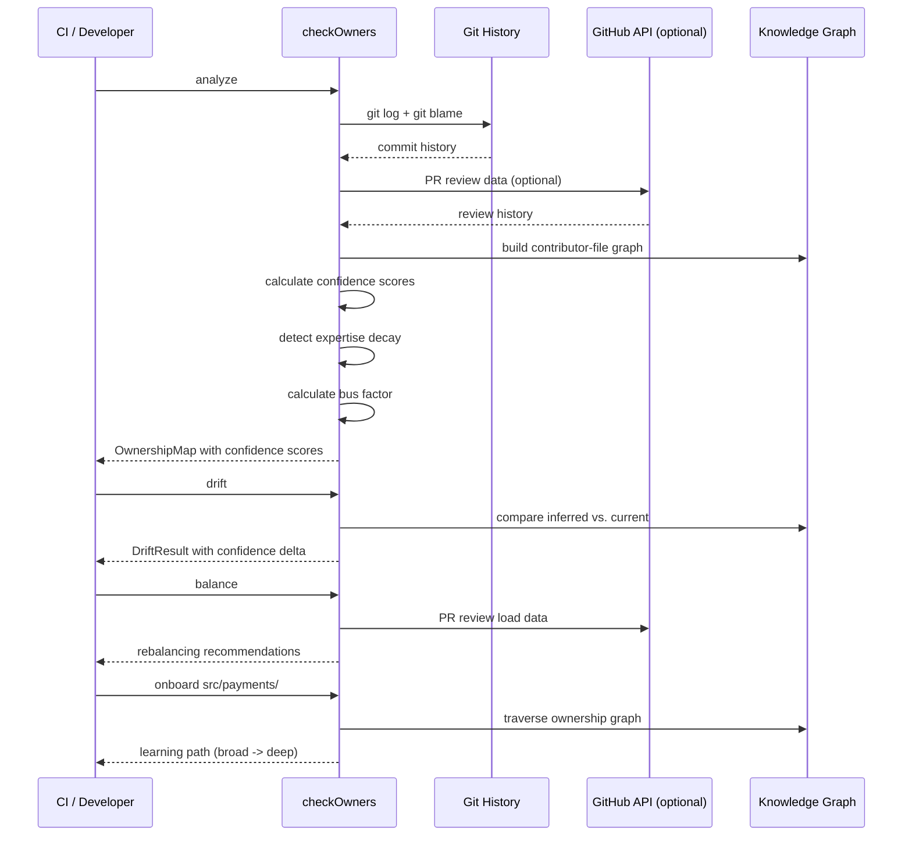

# checkOwners

*The only CODEOWNERS tool that builds a knowledge graph of who knows what, scores ownership confidence instead of binary claims, detects expertise decay, calculates bus factor, and generates onboarding paths, all from pure git history.*

> **PyPI:** `checkowners` (confirmed available, HTTP 404)
> **npm:** `checkowners` (confirmed available, HTTP 404)

---

## Problem Statement

- CODEOWNERS files drift silently as teams grow and directories get restructured
- No existing tool infers ownership from commit history; `git-codeowners` validates syntax only
- Manual maintenance does not scale; teams write one-off scripts that never generalize
- Review routing fails silently when CODEOWNERS entries point to teams that no longer exist
- **GitHub's CODEOWNERS fundamental flaw (from widespread complaints):** it treats ownership as binary (you own it or you don't) when reality is a spectrum; a developer who committed 200 times to a path 2 years ago is treated identically to one who committed 5 times last week
- **The stale ownership epidemic:** in organizations with >50 engineers, CODEOWNERS files are on average 6-12 months out of date; departed engineers, dissolved teams, and restructured directories create "ghost owners" that silently break review routing
- **The bus factor crisis:** teams discover single-point-of-knowledge failures only after an engineer leaves; no tool proactively identifies paths where only one person has meaningful expertise
- **The expertise decay blind spot:** `git blame` shows who last touched a file but not whether they still remember it; an engineer who committed 2 years ago but has not touched the code since may be listed as an owner but cannot effectively review changes
- **The onboarding wall:** new engineers joining a large codebase have no structured way to understand "who knows what" and "where should I start learning"; they ask around in Slack, which does not scale
- **The review load imbalance:** CODEOWNERS assigns reviews based on static ownership rules, leading to 2-3 "super-reviewers" who become bottlenecks while other qualified engineers are underutilized
- **The team topology mystery:** in large organizations, the actual team boundaries (who works together on what) often differ from the org chart; no tool infers implicit team structure from commit patterns

checkOwners fixes all of this with a pure-git, no-LLM inference engine that builds a knowledge graph, scores confidence, detects decay, calculates bus factor, and generates onboarding paths. Designed for CI-native use.

---

## Core Features

### Knowledge Graph (Who Knows What)
- Build a contributor-file-team relationship graph using networkx
- Visualize the knowledge graph in the terminal with Rich or export to DOT for Graphviz
- Query the graph: "Who are the top 5 people who know src/payments/?" with confidence-weighted results
- Track knowledge transfer: identify when expertise flows from one contributor to another via code reviews
- **No other CODEOWNERS tool does this.** Every competitor treats ownership as flat path-to-person mapping.

### Ownership Confidence Scoring (Not Binary)
- Every path-owner pair has a confidence score (0.0-1.0) based on:
  - **Commit recency:** exponential decay with configurable half-life (default 90 days)
  - **Commit frequency:** total commits in the lookback window
  - **Blame coverage:** percentage of current lines attributed to the contributor
  - **Review activity:** PR reviews on files in the path (when GitHub API is available)
- Generated CODEOWNERS uses confidence-weighted ranking; high-confidence owners listed first
- `checkowners expertise <path>` shows the full ranking with scores
- **No other CODEOWNERS tool does this.** Every competitor produces binary yes/no ownership.

### Expertise Decay Detection
- Flag contributors whose expertise is decaying: committed in the past but not recently
- Configurable decay threshold (default: 180 days since last commit to flag as decaying)
- Distinguish between "dormant expert" (high historical knowledge, recent inactivity) and "departed owner" (left the org)
- Produce decay reports with recommended ownership transfers
- **No other CODEOWNERS tool does this.** git blame shows historical authorship but not expertise freshness.

### Bus Factor Calculator
- Calculate bus factor per path: "How many people must leave before this path has no knowledgeable owner?"
- Paths with bus_factor=1 are flagged as critical risk (single point of knowledge failure)
- Aggregate bus factor across the entire repository to identify systemic knowledge concentration
- Recommend knowledge-sharing actions: "Engineer X should review PRs in src/auth/ to build backup expertise"
- **No other CODEOWNERS tool does this.** Bus factor analysis exists in academic tools but not in any CODEOWNERS CLI.

### Team Topology Inference
- Cluster contributors by commit co-occurrence patterns (contributors who commit to the same paths form implicit teams)
- Compare inferred teams against declared GitHub teams to identify misalignment
- Detect cross-team coupling: paths where multiple teams contribute (potential coordination bottleneck)
- Visualize team boundaries overlaid on the knowledge graph
- **No other CODEOWNERS tool does this.** Team topology discovery is manual in every organization.

### PR Review Load Balancer
- Analyze PR review distribution across contributors
- Detect overloaded reviewers ("super-reviewers" bottleneck) and underutilized qualified reviewers
- Suggest review rebalancing: "Route 30% of src/api/ reviews to @bob (confidence 0.72) to reduce @alice's load"
- Integrates with GitHub PR review API for accurate review history
- **No other CODEOWNERS tool does this.** GitHub's auto-assignment is random within the CODEOWNERS group; it does not consider load.

### Onboarding Path Generator
- Generate structured learning paths for new engineers joining a codebase area
- Paths follow the ownership graph: start with broadly-owned files (easy to understand, many reviewers) and progress to deep-expertise files
- Include recommended reviewers for each step and estimated complexity
- Export as Markdown checklist for onboarding documents
- **No other CODEOWNERS tool does this.** Onboarding is currently manual and inconsistent.

### Drift Detection with Confidence Delta
- Compare current CODEOWNERS against inferred state with confidence scores
- Report not just "stale" but "how stale": confidence dropped from 0.9 to 0.2 vs. slightly drifted from 0.8 to 0.7
- Priority-ranked drift reports: highest confidence-delta entries first
- State machine modes: `commit` (per-commit check), `repo` (full scan), or `both`

### CI and Notifications
- Outputs JSON for GitHub Actions via `GITHUB_OUTPUT`
- Composite GitHub Action (`action.yml`) for zero-config CI integration
- Webhook notifications for drift events with severity based on confidence delta
- PR comment with drift summary when CODEOWNERS-governed paths are modified

---

## Interaction Sequence



---

## CLI Commands

```bash
# Infer ownership from commit history with confidence scores
checkowners analyze

# Generate CODEOWNERS with confidence-weighted owners
checkowners generate

# Print inferred owners with confidence scores
checkowners print

# Validate existing CODEOWNERS syntax
checkowners validate

# Detect drift with confidence delta
checkowners drift

# Render knowledge graph in terminal
checkowners graph
checkowners graph --export dot > knowledge.dot

# Show expertise ranking for a path
checkowners expertise src/payments/

# Detect expertise decay
checkowners decay

# Infer team topology from commit patterns
checkowners topology

# Calculate bus factor
checkowners bus-factor src/
checkowners bus-factor --all

# Analyze review load balance
checkowners balance

# Generate onboarding path
checkowners onboard src/payments/

# Webhook notification on drift
checkowners notify

# Sync CODEOWNERS (generate + commit)
checkowners sync

# Run as a GitHub Action step
checkowners github-action
```

---

## Configuration

```yaml
# .github/checkowners.yml
analysis:
  lookback_days: 365            # extended from 180 for better historical analysis
  min_commits: 3
  top_n_owners: 3               # increased from 2 for better coverage
  confidence_threshold: 0.3     # minimum confidence to be listed as owner

scoring:
  recency_half_life_days: 90    # exponential decay half-life for commit recency
  recency_weight: 0.35          # weight of recency in confidence score
  frequency_weight: 0.25        # weight of commit frequency
  blame_weight: 0.25            # weight of blame coverage
  review_weight: 0.15           # weight of PR review activity (requires GitHub API)

decay:
  threshold_days: 180           # days since last commit to flag as decaying
  alert_on_decay: true          # include decay warnings in drift reports

bus_factor:
  critical_threshold: 1         # bus_factor <= this triggers critical warning
  warn_threshold: 2             # bus_factor <= this triggers warning

paths:
  exclude:
    - "*.lock"
    - "dist/**"
    - "vendor/**"
    - "node_modules/**"
    - "*.generated.*"

output:
  header: "# Generated by checkOwners. Do not edit manually."
  include_unowned: false
  include_confidence: true      # add confidence comments in generated CODEOWNERS

drift:
  mode: commit
  compare_to: auto
  min_confidence_delta: 0.2     # minimum delta to report as drift

notifications:
  webhook_url: ""
  include_unchanged: false
  severity_threshold: medium    # low | medium | high | critical

github:
  api_enabled: false            # enable GitHub API for review data + PR comments
  token: ${GITHUB_TOKEN}
```

---

## Phase 1: 7-Day MVP (Week 1)

| Day | Focus | Deliverable |
|-----|-------|-------------|
| 1 | Project scaffold | CLI entry point (Typer), config loader (`checkowners.yml`), test harness |
| 2 | Git analysis engine | `git log` + `git blame` parsing via GitPython; commit-to-path ownership map |
| 3 | CODEOWNERS generator | Path normalization; top-N owner selection; CODEOWNERS file writer |
| 4 | Drift detection | State machine comparing inferred vs. current CODEOWNERS; JSON diff output |
| 5 | GitHub Actions integration | `GITHUB_OUTPUT` writer; composite `action.yml`; CI example workflow |
| 6 | Notifications + validate | Webhook POST on drift; syntax-only validation command; `print` command |
| 7 | Packaging + publish | `pip install checkowners`, `npm install -g checkowners`, README, PyPI + npm release |

## Phase 2: Knowledge Intelligence (Weeks 2-4)

| Week | Focus | Deliverable |
|------|-------|-------------|
| 2 | Confidence scoring + expertise decay | Recency-weighted scoring algorithm; `expertise` command; `decay` command; decay reports |
| 3 | Knowledge graph + bus factor | networkx graph builder; `graph` command with Rich TUI; `bus-factor` command; DOT export |
| 4 | Team topology + review load balancer | Commit co-occurrence clustering; `topology` command; `balance` command with GitHub PR API |

## Phase 3: Ecosystem and Scale (Months 2-6)

| Month | Focus | Deliverable |
|-------|-------|-------------|
| 2 | Onboarding path generator + enhanced CI | `onboard` command; PR comment integration; branch protection integration |
| 3 | GitLab + Bitbucket support | Extend beyond GitHub; GitLab CODEOWNERS format; Bitbucket reviewer mapping |
| 4 | Historical trend analysis | Ownership confidence trends over time; expertise growth/decay charts |
| 5 | IDE extensions | VS Code extension showing ownership overlay; IntelliJ plugin; Neovim integration |
| 6 | Enterprise features + orchestiq integration | Multi-repo ownership aggregation; org-wide bus factor dashboard; API for downstream tools |

---

## Simple Data Model

```json
// ~/.checkowners/state.json  (auto-maintained)
{
  "schema_version": 2,
  "inferred": {
    "src/api/": {
      "owners": [
        {"handle": "@alice", "confidence": 0.92, "last_commit": "2026-03-25", "commits": 145},
        {"handle": "@bob", "confidence": 0.71, "last_commit": "2026-03-20", "commits": 67}
      ],
      "bus_factor": 2,
      "decay_warnings": []
    },
    "src/db/": {
      "owners": [
        {"handle": "@carol", "confidence": 0.85, "last_commit": "2026-03-15", "commits": 98}
      ],
      "bus_factor": 1,
      "decay_warnings": []
    },
    "src/auth/": {
      "owners": [
        {"handle": "@dave", "confidence": 0.34, "last_commit": "2025-06-12", "commits": 42}
      ],
      "bus_factor": 1,
      "decay_warnings": ["@dave: 289 days since last commit (threshold: 180)"]
    }
  },
  "topology": {
    "clusters": [
      {"team": "api-team", "members": ["@alice", "@bob"], "primary_paths": ["src/api/", "src/middleware/"]},
      {"team": "data-team", "members": ["@carol", "@eve"], "primary_paths": ["src/db/", "src/migrations/"]}
    ]
  },
  "bus_factor_summary": {
    "critical_paths": ["src/db/", "src/auth/"],
    "repo_average": 2.1
  },
  "last_analyzed": "2026-03-28T10:00:00Z",
  "drift_detected": true
}
```

---

## Installation

```bash
# PyPI (Python CLI)
pip install checkowners

# With knowledge graph visualization (networkx)
pip install checkowners[graph]

# npm (global binary)
npm install -g checkowners
```

---

## Stack

- **Language:** Python 3.11+
- **CLI framework:** Typer + Rich (colored drift output, knowledge graph TUI)
- **Git analysis:** GitPython + subprocess (`git log`, `git blame`, `git shortlog`)
- **GitHub integration:** PyGithub (Actions output, PR review data, PR comments)
- **Knowledge graph:** networkx (optional extra for graph features)
- **Config:** PyYAML (`.github/checkowners.yml`)
- **Packaging:** hatch for PyPI; composite GitHub Action (`action.yml`)

---

## Market Positioning

- **Target users:** GitHub teams managing mono-repos, platform engineering teams enforcing review routing policies, engineering managers tracking knowledge distribution, new engineers onboarding to large codebases
- **YC/A16Z alignment:** A16Z Big Ideas 2026: AI-native Git as a top developer-tools priority; Gartner 2025: "knowledge management in engineering organizations" as emerging priority; checkOwners provides the ownership intelligence layer that any AI code reviewer needs
- **Key differentiator:** The only CLI that builds a knowledge graph from git history, scores ownership confidence instead of binary claims, detects expertise decay, calculates bus factor, infers team topology, balances review load, and generates onboarding paths
- **Downstream product:** checkOwners is the OSS upstream of an enterprise offering that adds multi-repo ownership aggregation, org-wide bus factor dashboards, and automated ownership transfer workflows
- **The "only tool that..." claims:**
  1. Only CODEOWNERS tool with ownership confidence scoring (not binary yes/no)
  2. Only CODEOWNERS tool with a knowledge graph of who-knows-what
  3. Only CODEOWNERS tool with expertise decay detection
  4. Only CODEOWNERS tool with bus factor calculation per path
  5. Only CODEOWNERS tool with team topology inference from commit patterns
  6. Only CODEOWNERS tool with PR review load balancing recommendations
  7. Only CODEOWNERS tool with onboarding path generation
- **Closest competitors:**

  | Tool | GitHub Stars / Downloads | Type | Gap checkOwners fills |
  |------|------------------------|------|----------------------|
  | **git-codeowners** (PyPI, ~4K downloads/month) | PyPI package | CODEOWNERS validator | Validates syntax only; no inference, no confidence scoring, no knowledge graph |
  | **codeowners-validator** (GitHub Action) | GitHub Action | CODEOWNERS linter | Linting only; no inference, no drift detection, no expertise analysis |
  | **GitHub native CODEOWNERS** | Built-in | GitHub feature | Binary ownership; no confidence; no decay detection; no bus factor; manual maintenance only |
  | **Gitential** | SaaS | Engineering analytics | Server-based; expensive; analytics focus not CODEOWNERS generation; no CI integration |
  | **LinearB** | SaaS ($50K+/year) | Engineering intelligence | Enterprise SaaS; not CLI; not open source; no CODEOWNERS generation |
  | **Pluralsight Flow** (formerly GitPrime) | SaaS | Developer analytics | Acquired by Pluralsight; enterprise-only; not open source; no CODEOWNERS focus |
  | **git-fame** | ~1K stars | Git contributor stats | Statistics only; no ownership inference; no CODEOWNERS generation; no knowledge graph |
  | Manual CODEOWNERS maintenance | N/A | Manual | Error-prone; drifts silently; no confidence; no decay detection; does not scale |

- **Unique positioning:** checkOwners is the only tool that combines (1) git-history-based ownership inference with confidence scoring, (2) knowledge graph visualization, (3) expertise decay detection, (4) bus factor calculation, (5) team topology inference, (6) PR review load balancing, (7) onboarding path generation, and (8) CI-native JSON output with GitHub Actions integration in a single CLI binary

---

## Success Metrics (6 months)

- PyPI downloads: target 5,000/month
- GitHub stars: target 500-2,000
- Active contributors: target 20+
- GitHub Marketplace installs: 200+ by month 3
- Bus factor alerts: identify critical single-point-of-failure paths in 95% of scanned repos

## Success Metrics (by 2030)

- PyPI downloads: target 30,000+/month
- GitHub stars: target 8,000+
- Industry standard for CODEOWNERS management (referenced in platform engineering playbooks)
- Multi-platform support: GitHub, GitLab, Bitbucket, Azure DevOps
- Knowledge graph becomes the foundation for AI-assisted code review assignment
- Enterprise offering generating revenue from org-wide ownership intelligence
