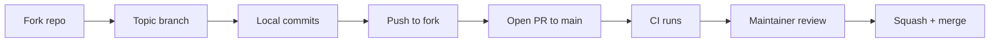

# Contributing to checkowners

Thanks for thinking about contributing. checkowners is a pure-git ownership inference engine; this guide covers the local workflow, the conventions enforced by CI, and the PR process.

## Quick start

```bash
git clone https://github.com/fortyOneTech/checkowners.git
cd checkowners
pip install hatch
hatch run test
```

`hatch run test` builds the env, installs the optional `[graph]` extra, runs the suite with coverage, and prints any missing-line report. Everything else (lint, format, build) flows through the same environment.

## Common commands

| Command | What it does |
|---------|--------------|
| `hatch run test` | pytest with coverage; target is 85% or higher |
| `hatch run test -- tests/test_analyze.py` | run a single test file |
| `hatch run test -- -k "test_name"` | run tests matching a substring |
| `hatch run lint` | ruff check + mypy `--strict` |
| `hatch run fmt` | ruff format |
| `hatch build` | produce sdist and wheel in `dist/` |

CI runs `hatch run test` across Python 3.11, 3.12, and 3.13, builds the wheel, smoke-tests every CLI subcommand against the built artifact, and runs `hatch run lint` plus a `hatch run fmt --check`. Match those locally before opening a PR.

## Branch and PR workflow



1. Fork the repo and create a branch named after the change (`feat/topology-overlap`, `fix/validate-inline-comments`).
2. Keep commits focused; one conventional commit per logical step. Squash-and-merge is the default, so commit history inside the branch can be granular without polluting `main`.
3. Open the PR against `main`. The PR description should state the user-visible behavior change, link to any related issue, and call out follow-up work that is intentionally out of scope.
4. Wait for CI; fix anything red. Maintainers review once CI is green.

## Conventional commits

Every commit on `main` follows the [Conventional Commits](https://www.conventionalcommits.org/) spec so the changelog can be generated mechanically:

- `feat(<scope>): <subject>` for user-visible additions
- `fix(<scope>): <subject>` for bug fixes
- `docs(<scope>): <subject>` for documentation
- `chore(<scope>): <subject>` for tooling / metadata
- `ci(<scope>): <subject>` for workflow changes
- `test(<scope>): <subject>` for test-only changes

Scopes match module names (`analyze`, `drift`, `cli`, etc.) or umbrella areas (`docs`, `ci`, `security`). The commit body explains the *why* and the body lines stay wrapped at 80 columns or so.

## Code conventions

- Python 3.11 minimum. Use modern syntax (`X | Y` unions, `dict[str, int]`).
- Functional style. The only classes allowed are dataclasses in `models.py` and small frozen dataclasses living inside the module that returns them.
- Type hints on **every** function signature; `mypy --strict` is enforced.
- All paths via `pathlib.Path`; never hardcode strings.
- New CLI subcommand? Wire it in `cli.py`, give it a `--json` mode, and persist results through `state.write_state` when appropriate.
- Ownership is never binary: every owner carries a confidence score, clamped to `[0.0, 1.0]`.

For the architecture overview and module map, see [CLAUDE.md](../CLAUDE.md).

## Tests

- Every module has a `tests/test_<module>.py`.
- Unit tests mock all subprocess calls (`git log`, `git blame`); they must not require a real git repo.
- Tests that touch `~/.checkowners/state.json` set the `CHECKOWNERS_STATE_DIR` env var so they don't clobber the contributor's real state.
- Coverage target is 85% repo-wide; new modules should land above that.

## Reporting bugs

Open an issue at <https://github.com/fortyOneTech/checkowners/issues> with:

1. The command you ran and the `--json` output if available.
2. The relevant `.github/checkowners.yml` (redact tokens; we don't accept them in this file anyway).
3. Repo characteristics that matter (contributor count, lookback window, whether `github.api_enabled` is on).
4. Expected behavior vs. observed behavior.

## Security issues

Do not open public issues for vulnerabilities. Email <samir.musali@gmail.com> with a description and a proof-of-concept. We will respond and coordinate disclosure.

## Releasing

Tagged releases trigger `.github/workflows/publish.yml` which builds and uploads to PyPI via Trusted Publisher. Steps:

1. Bump `version` in `pyproject.toml` and `__version__` in `checkowners/__init__.py`.
2. Update [docs/CHANGELOG.md](CHANGELOG.md) with the new section.
3. Tag the commit: `git tag -a v0.X.Y -m "v0.X.Y"` and push the tag.
4. Create a GitHub Release pointing at the tag; the publish workflow takes it from there.
