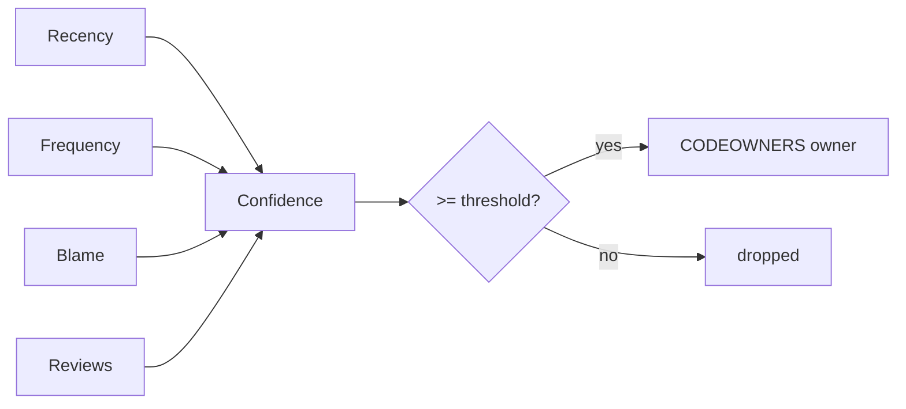

# Usage

Full configuration, scoring, and CI reference. For a quick command list see the [README](../README.md). For answers to common questions see [docs/FAQ.md](FAQ.md).

## Configuration

Create `.github/checkowners.yml`. Every field is optional; defaults shown.

```yaml
analysis:
  lookback_days: 365
  min_commits: 3
  top_n_owners: 3
  confidence_threshold: 0.3   # owners below this are dropped from CODEOWNERS

scoring:
  recency_half_life_days: 90  # exponential decay half-life
  recency_weight: 0.35
  frequency_weight: 0.25
  blame_weight: 0.25
  review_weight: 0.15         # only counted when github.api_enabled

decay:
  threshold_days: 180         # flag owners idle longer than this
  alert_on_decay: true

bus_factor:
  critical_threshold: 1
  warn_threshold: 2

paths:
  exclude:
    - "*.lock"
    - "dist/**"
    - "vendor/**"
    - "node_modules/**"
    - "*.generated.*"

output:
  header: "# Generated by checkOwners. Do not edit manually."
  include_unowned: false
  include_confidence: false   # if true, append "# alice(0.92) bob(0.71)" to each line

drift:
  mode: commit                # commit | repo | both
  compare_to: auto
  min_confidence_delta: 0.2   # suppress small-delta drift

notifications:
  webhook_url: ""             # literal, or ${ENV_VAR} to read from the environment
  include_unchanged: false
  severity_threshold: medium  # low | medium | high | critical

github:
  org: ""
  resolve_handles: true       # email to @handle via search API
  resolve_teams: true         # collapse owner sets to a @org/team when possible
  api_enabled: false          # gate review_weight + topology/balance API features
```

The GitHub token is **never** read from this file. Set the `GITHUB_TOKEN` environment variable instead. `checkowners.yml` is committed to your repo, so storing a token here would push it to GitHub. `load_config` raises a clear error if `github.token` is present. For the same reason, `notifications.webhook_url` supports a `${ENV_VAR}` reference (for example `${CHECKOWNERS_WEBHOOK_URL}`) so a committed config can point at a secret endpoint without storing it; an unset variable resolves to an empty string.

## Confidence scoring

Each path-owner pair gets a confidence score in `[0.0, 1.0]` derived from four signals:

| Signal | Source | Weight (default) |
|--------|--------|------------------|
| Recency | `exp(-ln 2 × days_since_last_commit / half_life)` | 0.35 |
| Frequency | `commits / max_commits_for_path` | 0.25 |
| Blame coverage | `git blame --line-porcelain` lines / total lines | 0.25 |
| Review activity | PR reviews on the path (requires `github.api_enabled`) | 0.15 |



Weights are configurable under `scoring`. The final score is clamped to `[0.0, 1.0]`; owners below `analysis.confidence_threshold` are dropped from the generated CODEOWNERS. Bus factor per path is the count of remaining qualified owners.

## Drift and severity

`checkowners drift` compares the inferred ownership against the existing CODEOWNERS and emits a JSON payload that downstream callers (CI, webhooks) can branch on.

`notify.compute_severity` maps the max confidence delta plus bus-factor / decay flags to a tier:

| Severity | Trigger |
|----------|---------|
| `critical` | Any drift entry has `bus_factor <= 1` or is `decay = true` |
| `high` | `max_confidence_delta >= 0.7` |
| `medium` | `max_confidence_delta >= 0.3` |
| `low` | otherwise |

`notifications.severity_threshold` decides when a webhook fires, and `--json` always includes the `severity` field so CI workflows can branch on it.

## GitHub Actions

```yaml
name: checkowners
on: [pull_request]

jobs:
  drift:
    runs-on: ubuntu-latest
    permissions:
      contents: read
      pull-requests: write
    steps:
      - uses: actions/checkout@v4
        with:
          fetch-depth: 0
      - uses: smusali/checkowners-action@v1
        with:
          mode: repo
          config: .github/checkowners.yml
```

`checkowners drift --json` writes `checkowners_drift` to `GITHUB_OUTPUT` with `drift_detected`, `max_confidence_delta`, `severity`, and per-entry `bus_factor` / `decay` flags so workflows can label PRs, comment, or fail required checks.

The composite action also accepts `fail_on_drift: "false"` if you want to comment without blocking, `include_bus_factor` / `include_decay` toggles for the secondary outputs, and `comment_on_pr` (default `"true"`) which posts a built-in drift + bus-factor summary comment on pull requests (the job must grant `pull-requests: write`).

## How checkowners compares

| Tool | Inference | Confidence | Drift | Bus factor | Decay | Topology | Onboarding |
|------|-----------|------------|-------|------------|-------|----------|------------|
| **checkowners** | git log + blame | yes (four-factor) | yes (with delta + severity) | yes (per-path + backups) | yes (transfer suggestions) | yes (inferred + GitHub reconcile) | yes (Markdown checklist) |
| git-codeowners (PyPI) | no | no | no | no | no | no | no |
| codeowners-validator (Action) | no | no | no | no | no | no | no |
| GitHub native CODEOWNERS | no | no | no | no | no | no | no |
| Manual CODEOWNERS | no | no | no | no | no | no | no |

## Development

See [docs/CONTRIBUTING.md](CONTRIBUTING.md) for the full contributor guide. Common commands:

```bash
hatch run test              # pytest with coverage
hatch run lint              # ruff check + mypy --strict
hatch run fmt               # ruff format
hatch build                 # sdist + wheel in dist/
```
